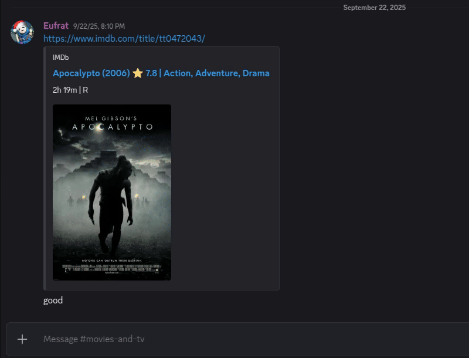

# Summaru - A Versatile Discord AI Assistant


<a href="https://ko-fi.com/zzephyrel"></a>

**Summaru** is a Discord application that brings the power of a Large Language Model into your server. It can summarize conversations, answer questions and fulfill any request with full chat context and web search capabilities.



## 📜 Table of Contents

- [🚀 About The Project](#-about-the-project)
- [🌟 Features](#-features)
- [💬 Usage](#-usage)
- [🛠️ Installation & Setup](#️-installation--setup)
- [⚙️ Configuration](#️-configuration)
- [☁️ Hosting](#️-hosting)
- [🛡️ Data Privacy, Usage & Security Disclaimer](#️-data-privacy-usage--security-disclaimer)
- [💖 Support the Project](#-support-the-project)
- [🏛️ Architecture Highlights](#️-architecture-highlights)
- [📄 License](#-license)


## 🚀 About The Project

Ever been away from Discord for a day and come back to thousands of unread messages? Or maybe you're in the middle of a heated discussion and need a fact-checker, a devil's advocate, or a creative spark on demand?

**Summaru is designed for both.**

It acts as your server's AI-powered swiss army knife, capable of parsing past conversations to catch you up and engaging with current ones to **fulfill any request**. It can function as two distinct tools:

1. **For catching up:** A **Summarizer** that condenses vast amounts of chat history into concise, scannable bullet points.
2.  **For everything else:** There's... the **AI Assistant**, ready to answer questions, settle debates, or fulfill requests using the conversation context, its own knowledge, and web search capabilities.

The bot is highly configurable, allowing you to change its core personality and behavior with ease. See the [**Configuration section**](#️-configuration) for more details.

The core architecture is built with node.js and discord.js, and was designed to be:
*   **Resilient:** Handles API rate limits and errors gracefully without failing.
*   **Memory-Efficient:** Uses a custom caching strategy to minimize RAM usage.
*   **Concurrent:** Safely processes multiple summary requests at once without race conditions.


## 🌟 Features

Summaru comes loaded with features designed to save you time, boost engagement, and unleash creativity in your server.

*   **Catch Up Instantly:** Use the `/summarize` command to get a quick bullet point summary of the last 100 (or 20k) messages, the last X hours, or everything since you last spoke. Never feel out of the loop again.
*   **Go Beyond Summaries:** Use the `/ask` command to ask for **anything**. Ask it to weigh in on a discussion, roast your friends, fetch the latest news or even decide what game you're all playing tonight so you can stop arguing.
*   **Privacy First:** Responses are delivered privately to you by default. If you get a result worth sharing, you can make it public for the whole channel with a single click.
*   **Fast as can be:** Receive a response within seconds thanks to a custom caching system. The only delay is how long the LLM itself takes to answer.
*   **Always Available:** If the AI model is busy, the bot automatically switches to a backup to ensure it's always ready for your requests.
*   **Your Bot, Your Rules:** As the host, you control everything from a single config file. Change the AI's entire personality with custom system prompts, adjust model priority and temperature, fine-tune caching, and set your own rate limits.

## 💬 Usage

The bot has two primary commands, `/ask` and `/summarize`. Simply start typing them, and Discord's interactive menu will guide you.

### `/summarize` Command
Condenses chat history into a concise, bulleted list of key topics and moments.

#### Subcommands

*   **`/summarize amount`**
    *   Summarizes the last X messages.
    *   **Example:** `/summarize amount count: 150`

*   **`/summarize hours`**
    *   Summarizes messages from the past X hours.
    *   **Example:** `/summarize hours duration: 12`

*   **`/summarize days`**
    *   Summarizes messages from the past X days.
    *   **Example:** `/summarize days duration: 3`

*   **`/summarize since_last`**
    *   Summarizes messages since you last spoke in the channel.
    *   **Example:** `/summarize since_last`

#### Optional Arguments for `/summarize`
These can be added to any of the subcommands above.

| Argument       | Description                                                                 | Example                                            |
| :------------- | :-------------------------------------------------------------------------- | :------------------------------------------------- |
| `instructions` | Provide custom instructions for the AI                                      | `instructions: Focus on news from Charles`         |
| `public`       | Set to `True` to make the summary visible to everyone. Defaults to `False`. | `public: True`                                     |

### `/ask` Command
Ask the AI a question—or give it a command—via the `request` argument, with the option to use chat history as context.


#### Subcommands

*   **`/ask now`**
    *   Make a request without providing any chat history as context.
    *   **Example:** `/ask now request: What are the 3 biggest news of the past week from around the world?`

*   **`/ask amount`**
    *   Make a request using the last X messages as context.
    *   **Example:** `/ask amount count: 5000 request: Cast each of the participants as a character in a popular movie and briefly explain why.`

*   **`/ask hours`**
    *   Make a request using messages from the past X hours as context.
    *   **Example:** `/ask hours duration: 8 request: Can you explain the inside joke about the 'sentient toaster' from this morning?`

*   **`/ask days`**
    *   Make a request using messages from the past X days as context.
    *   **Example:** `/ask days duration: 7 request: Find the link to that planning document that was shared this week.`

*   **`/ask since_last`**
    *   Make a request using the messages since you last spoke as context.
    *   **Example:** `/ask since_last request: Did I miss anything big or was it all just yapping?`

#### Optional Arguments for `/ask`
These can be added to any of the subcommands above.

| Argument | Description                                                                  | Example        |
| :------- | :--------------------------------------------------------------------------- | :------------- |
| `public` | Set to `True` to make the response visible to everyone. Defaults to `False`. | `public: True` |


## 🛠️ Installation & Setup

This guide will walk you through the entire process of setting up Summaru, from creating the Discord Application to running the code.

### Prerequisites

*   [Git](https://git-scm.com/downloads)
*   [Node.js](https://nodejs.org/) (v20.0.0 or later)
*   A **Google Gemini API Key**. You can get one from [Google AI Studio](https://aistudio.google.com/app/apikey).

### Step 1: Create the Discord Application & Bot

This is where you will create the bot's identity on Discord and get the necessary credentials.

1.  **Go to the Discord Developer Portal:** Navigate to the [Applications page](https://discord.com/developers/applications).

2.  **Create a New Application:** Click the **"New Application"** button in the top-right corner, give it a name (e.g., "Summaru"), and click "Create".

3.  **Get the Application ID (Client ID):** On the **"General Information"** page, copy the `APPLICATION ID`. This is the value you will use for the `CLIENT_ID` variable in your `.env` file.

4.  **Navigate to the Bot Page:** Select the **"Bot"** tab on the left-hand menu. This is the page where you will find the bot's token and configure its permissions.

5.  **Get the Bot Token:** Click the blue **"Reset Token"** button to reveal your bot's token. **Copy this and save it securely. This is the bot's password; do not share it with anyone.** This is the value you will use for the `DISCORD_TOKEN` variable in your `.env` file.

6.  **Enable Privileged Intents:** This is a critical step. On the same "Bot" page, scroll down and **enable the following toggle**:
    *   **`MESSAGE CONTENT INTENT`** (‼️**Required for the bot to read messages**)

You now have your `CLIENT_ID` and `DISCORD_TOKEN`.

### Step 2: Open Your Command Line

All the commands in the following steps will be run in this window.

*   **On Windows:**
    1.  Press the **Windows Key** (or click the Start button).
    2.  Type `PowerShell`.
    3.  Select **Windows PowerShell** from the results.

*   **On macOS:**
    1.  Open the **Finder**.
    2.  Go to the **Applications** folder, then the **Utilities** folder.
    3.  Open the **Terminal** application.

*   **On Linux:**
    1.  Open your applications menu and find the **Terminal** application.

### Step 3: Set Up the Project Locally

Now, let's get the code and connect it to the bot you just created.

> [!NOTE]
> Your terminal window opens in your user's home directory by default (e.g., `C:\Users\YourName` on Windows or `~/` on macOS/Linux). The following commands will create the project folder there.
>
> If you prefer to place the project on your Desktop for easier access, you can run `cd Desktop` first.


1.  **Clone the repository and navigate into the project folder:**
    ```sh
    git clone https://github.com/ZZephyrel/Summaru.git
    cd Summaru
    ```

2.  **Install NPM packages:**
    ```sh
    npm install
    ```

3.  **Configure your environment variables:**
    Create a file named `.env` in the root of the project. Paste in the credentials you just copied.

    **Careful:** If using **Notepad** or similar editors they may try to save the file as `.env.txt`. Ensure the file has no extension.

    ```sh
    # .env file
    DISCORD_TOKEN=YourDiscordBotTokenHere
    GEMINI_API_KEY=YourGeminiApiKeyHere
    CLIENT_ID=YourApplicationClientIDHere
    ```

    > To deploy the commands to only a single test server add `TEST_GUILD_ID=YourServerIDHere` to your `.env` file. Remove it again to deploy globally.

### Step 4: Add the Bot to Your Server

1.  **Go back to the Discord Developer Portal** for your application.
2.  Navigate to **"OAuth2" -> "URL Generator"**.
3.  In the "Scopes" box, select the following:
    *   `bot`
4.  A "Bot Permissions" box will appear below. Select the following permissions:
    *   `View Channels`
    *   `Send Messages`
    *   `Read Message History`
5.  **Copy the Generated URL** at the bottom of the page.
6.  Paste the URL into your browser, select the server you want to add the bot to, and click "Authorize".

### Step 5: Run the Bot
> [!IMPORTANT]
> These commands must be run from the root directory of the project. This ensures that the `.env` file can be found correctly.
1.  **Deploy the slash commands:**
    This only needs to be done once initially, then whenever you change a command's definition in [`deploy-commands.js`](./src/deploy-commands.js) or arguments like `MAX_MESSAGES` in `config.js`.
    ```sh
    node src/deploy-commands.js
    ```

2.  **Start the bot:**
    ```sh
    node src/index.js
    ```
Your bot should now be online and ready to respond to commands in your server.


## ⚙️ Configuration

All major settings are located in the `config.js` file, allowing you to tailor the bot's behavior without touching the core logic. For more details on each variable, please refer to the comments within the file itself.

Here’s an overview of the key areas you can customize:

#### AI Configuration
*   **`summarizeSystemInstruction` & `askSystemInstruction`**: Edit these prompts for the `/summarize` and `/ask` commands respectively to redefine the bot's entire personality, behavior and objectives.
*   **`TEMPERATURE`**: Controls the randomness of the AI's output. Lower values (e.g. `0.3`) make responses more accurate and consistent, while higher values (e.g. `0.9`) encourage more creative and surprising results. The effective range is 0.0 to 2.0, though staying below 1.0 is recommended for most use cases.
*   **`models`**: This map controls the list of Gemini models and their fallback priority. The bot will always try the first model and work its way down on failure.
*   **`safetySettingsConfig`**: This array controls the content safety filters for the Gemini API. You can adjust these thresholds as needed.
*   **`generateSummarizePrompt` & `generateAskPrompt`**: For deeper customization, you can edit these functions to change the very structure of the prompts sent to the AI.

#### Bot Operation & Limits
*   **`CACHE_SIZE_PER_CHANNEL`**: This is the main lever for controlling memory usage. A larger cache leads to faster context gathering and avoids unnecessary API requests but uses a bit more RAM.
*   **`USER_RATE_LIMIT_COUNT` & `USER_RATE_LIMIT_WINDOW_MS`**: These variables work together to define how many commands a single user can run within a specific time window.

## ☁️ Hosting

Running the bot on your personal computer is perfect for setup and testing. However, the bot will go offline as soon as you close the terminal window or shut down your machine. To keep your bot online 24/7, you need to host it on a server that is always running.

### Cloud Hosting with a VM

The most common and reliable way to do this is by using a cloud hosting provider to run a **Virtual Machine (VM)**, often called a **Virtual Private Server (VPS)**. Think of this as a personal computer that you rent in the cloud, which stays on all the time and that you can access from anywhere.

While there are many excellent cloud providers (like AWS, Google Cloud, and DigitalOcean), a great starting point is [**Oracle Cloud Infrastructure (OCI)**](https://www.oracle.com/cloud/). They are recommended here because their [Always Free](https://docs.oracle.com/en-us/iaas/Content/FreeTier/freetier_topic-Always_Free_Resources.htm) tier is generous enough to run a Discord bot like Summaru for **many servers at no cost**. To take advantage of this, look for the **`VM.Standard.A1.Flex`** shape when creating your instance. You'll likely have to input payment information to get priority on VM creation, but you will not be charged as long as you stay within the free tier limits.

### Getting Started

Setting up a cloud server for the first time can seem complex, but it's a well-documented process. The general steps are:
1.  Sign up for a cloud provider.
2.  Create a new VM instance (a popular choice for the operating system is **Ubuntu Linux**).
3.  Connect to your VM via **SSH** using a terminal (e.g. PowerShell on Windows)
4.  Follow the same [**Installation & Setup**](#️-installation--setup) steps from this guide on your new cloud server.

For a detailed, step-by-step walkthrough on creating and connecting to a VM on a specific platform, you can simply **ask an AI** like Gemini, Claude or ChatGPT to guide you through the process, or search for video tutorials on platforms like **YouTube**.

### Keeping the Bot Running

Once you've run `node src/index.js` on your server, the process will stop as soon as you close the terminal. To solve this, you need a tool to keep the process **running in the background**.

While you could use a simple terminal multiplexer like `tmux` or `screen`, a more robust solution is a dedicated process manager. [**PM2**](https://pm2.keymetrics.io/) is an excellent tool for this. It will run your bot as a background service and even automatically restart it if it crashes.

After installing Node.js on your server, you can set it up with a few simple commands:

```sh
# Install PM2 globally
npm install pm2 -g

# Start your bot with PM2 and give it a name
pm2 start src/index.js --name "summaru"

# Tell PM2 to automatically restart on server reboot
pm2 startup

# Save the current process list
pm2 save
```

Your bot is now running 24/7 in the background. You can check on its status anytime by running `pm2 list` and monitor it in real-time via `pm2 monit`.

## 🛡️ Data Privacy, Usage & Security Disclaimer

> **A Note on Security & Liability:** This project is maintained on a best-effort basis. While I strive to follow security best practices, no software is perfectly secure.
>
> Like all open-source software provided under the [MIT License](LICENSE), this code is offered **"AS IS" without any warranty**. The original author is not liable for any security vulnerabilities or any modifications made by third parties who host the bot.

To function, Summaru sends a portion of conversation data to a third-party AI service, the **Google Gemini API**. It's important to understand how this process works.

> [!IMPORTANT]
> **Be mindful of your data**.
> You should avoid sharing highly sensitive personal information in channels where Summaru is active.

### Q: What specific data is sent to Google?

When you run a command, the bot packages **only** the essential data required to get a relevant response. This package includes:

*   **Message Content:** The full text of the messages within the requested context.
*   **User Display Names:** The server display name (or username) of the person who sent each message.
*   **Timestamps:** The time each message was created, used by the AI to understand the flow of conversation.
*   **Your Instructions:** The specific query or instructions you provide in the command.

The bot **does not** send user IDs, email addresses, or attachments (such as images). Once sent, this data is subject to [Google's Privacy Policy](https://policies.google.com/privacy).

### Q: Does Summaru store my conversations?

**No.** The bot itself does not have a database and **does not permanently store your conversations.**

To provide fast responses, it keeps a **temporary** cache of recent messages **in memory**, which is cleared when the bot restarts. As a **self-hosted application**, this in-memory data resides on the server controlled by the bot's host. 

This cached data is **only** used to provide context for your commands. The bot, **as designed and provided in this repository**, has the sole purpose of acting as a secure conduit to the Google Gemini API; **your data is not used for anything else**.


### A Note for Server Admins:

#### Informing Your Users
To be transparent and help your members use the bot with confidence, you should communicate this data handling process to them. A pinned message in relevant channels or a note in your server's rules is a great way to do this.

#### Managing Bot Access
By default, Summaru will read messages from **all channels** it can see and will be available for use by **any server member** that can use slash commands. As an administrator, **you have full control over this**. Here are two ways to manage the bot's access:

> [!IMPORTANT]
> You will have to restart the bot for these changes to take full effect.

#### Method 1: Disabling Commands

This is the way to completely disable the bot commands in **specific channels** or **for certain roles**.

1.  Go to **Server Settings** > **Integrations**.
2.  Select the **Summaru** bot from the list.
3.  Under the **Command Permissions** section, you can add rules to deny access to specific commands (or all of them) for the channels and roles you choose.

> [!NOTE]
> The bot will continue to cache messages for the channels. If you want to disable that for memory usage, also remove the channel permissions as described below.

#### Method 2: Removing channel permissions

You can also block the bot from **viewing** a channel.

1.  Go to the channel you want to restrict.
2.  Click **Edit Channel** (gear icon) > **Permissions**.
3.  Under **Advanced Permissions** add the bot member (e.g., "Summaru").
4.  **Deny** the **`View Channel`** permission.

> [!TIP]
> If you do this **without** disabling the commands as in Method 1, then users will still be able to use the `/ask now` subcommand **privately**. This command **does not expose any sensitive data from the chat history**, just the request to the AI. This is a great way to allow users to **privately ask general questions without giving the bot access to conversation history**.

## 💖 Support the Project

Summaru is a passion project, developed and maintained in my free time. If you and your community find Summaru valuable, please consider showing your appreciation and supporting its development.

Every contribution is greatly appreciated!

[](https://ko-fi.com/zzephyrel)

## 🏛️ Architecture Highlights

For developers and those interested in the technical details, this project implements several advanced features to ensure robustness and efficiency:

*   **Custom Caching System:** The app opts out of the default discord.js message cache in favor of a custom, in-memory `LimitedCollection`. This provides full control over data handling, ensuring a **predictable, chronologically ordered** set of messages essential for **instant context gathering and minimizing Discord API calls**.

*   **Memory-Efficiency:** The custom cache employs a "message stripping" pattern. Instead of storing the bloated `Message` object, it stores a **lean, minimal representation** with only essential data (`id`, `content`, `author`). This **drastically reduces RAM usage**, allowing the bot to scale efficiently.

*   **Cache Coherency:** The cache maintains **high data integrity** by handling the complete message lifecycle. It processes `messageCreate`, `messageUpdate`, `messageDelete`, and `messageDeleteBulk` events in real-time to ensure the context provided to the AI is always perfectly current.

*   **Startup Event Queuing:** To prevent race conditions, the bot **safely queues all incoming events** during its initial cache population phase. Once the cache is fully synchronized, it processes the queue, ensuring **zero data loss** during the startup sequence.

*   **Robust Concurrency:** Simultaneous commands are handled using an **optimistic concurrency pattern**. This prevents race conditions where multiple failures could unfairly penalize a model, ensuring **accurate state management** even under heavy load.

*   **Automatic Model Fallback:** The app utilizes a prioritized pool of Gemini models. If a model is rate-limited, it's placed on a **smart, two-stage cooldown** (escalating from a short to a long penalty), and the bot **seamlessly fails over** to the next available model, ensuring high availability for the user.

*   **Configurable Per-User Rate Limits:** Protects against API abuse with a built-in, **sliding-window rate limiter** for all users. It includes an automatic garbage collection mechanism to prevent memory leaks over time.


## 📄 License

This project is licensed under the MIT License. See the [LICENSE](LICENSE) file for details.